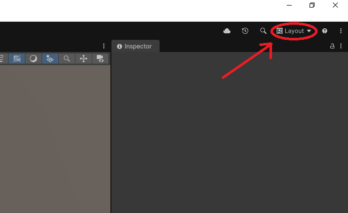
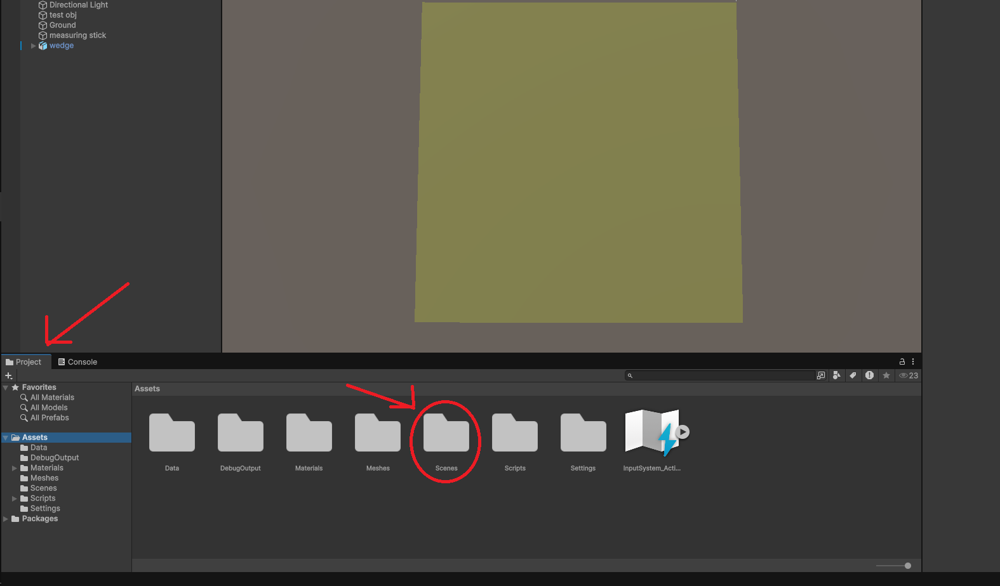
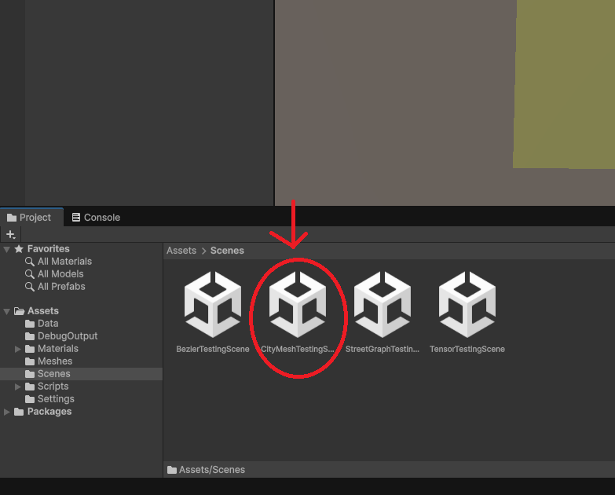
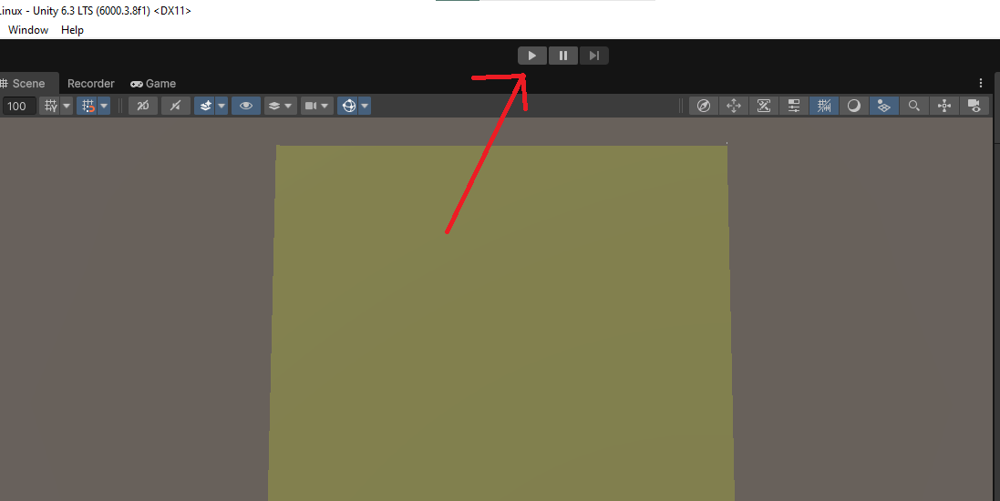
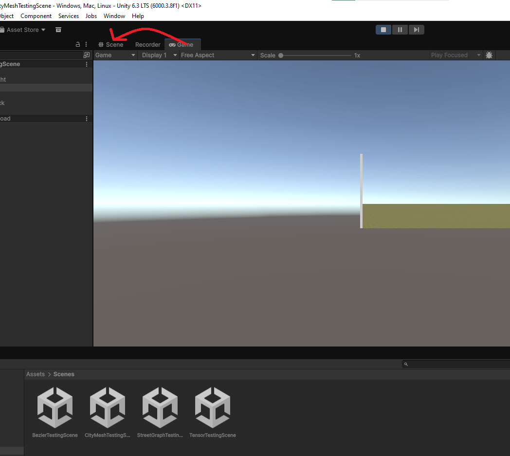
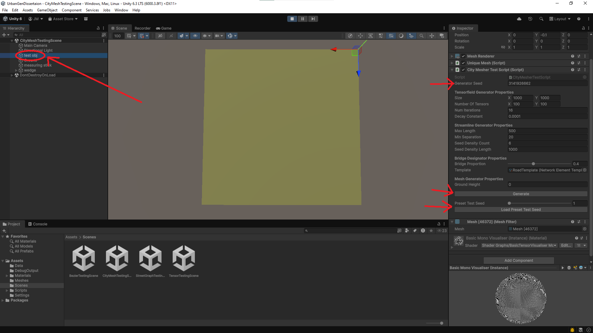

# UrbanGenDissertaion

This is the repository for my university undergrad dissertation project.
This project is/was being developed in my 3rd year at the University Of Exeter from 2025 to 2026.

## How to run the code:

1. Install the Unity Hub application from: (https://unity.com/download)
2. From the Unity Hub install Unity version 6.3 LTS
-
3. Clone this repository to your machine.
4. In the Unity Hub, go to the "Projects" window
5. Click on the "Add" dropdown then click "Add project from disk"
6. In the file explore window that opens, find the root folder of this repository and click "open"
-
7. Now the project apears in the "Projects" window, click on the name of the project "UrbanGenDissertation"
8. Unity Game Engine will start to load, this first time will take a while (around 3 minutes) as it needs to set up all of the non-code files that are left out of this repository
-
9. Once Unity Game Engine opens, click on the "layout" dropdown and select "Default", this will allow you to see all the windows (if you are already in the default layout you will notice no change)

10. Navigate to the "Project" tab and open (double click) the "Scenes" folder.

11. Open the scene "CityMeshTestingScene".

12. Run the scene by clicking the play (triangle) button.

13. Unity will automatically switch to game view, so click on the "Scene" tab to switch back to scene view.

14. Select the object "test obj" in the "heirachy" tab.
15. Look at the inspector, either:
    - Input your own seed ("0" results in a random seed being used)
    - Use the "Preset Test Seed" slider and "Load Preset Test Seed" button to load one of the 5 test seeds.
16. Press the "Generate" button and watch the roads generate.

## The topic proposal went as follows:

Procedural generation is a powerful tool in games to speed up asset creation or even create novel virtual worlds around the player at run time. Many procedural generation aproaches for dynamically creating urban environments are defined by systems of square road grids, so the resulting cities miss out on the unique charm of densely interconnected urban areas and freeform pedestrian spaces. In this project I will research and develop techniques for creating virtual cities that capture these elements.

See central Manchester around Castlefield and the old town of Cordoba, Spain for examples of charming densely connected urban areas.

I imagine the aproach may involve splines and curves surrounded by bounding volumes so elements can grow while avoiding clipping through their neighbours and deciding when to for intersections with them. Buildings can be modeled as volumes filling in the space unused by the elements.

The program will be built in a game engine so I can focus on the core project without wasting time on the surrounding infrastructure.

The feature goals are:

Minimum Product: 
* A program that can generate a freeform streetplan that includes pedestrian pathways, roads, and buildings. 
* The most minimum version could be a 2d plan like a map.

Important features:
* 3d generation with basic boxy buildings.
* Generate meshes for the city that can be exported.
* Support for overlapping elements ie support for bridges, viaducts, tunnels.
* Rail, Rivers, Parks, Plazas/Courtyards,

Stretch Goals:
* Terrain that isn't flat (i.e. hills).
* Deterministic generation tiles (so am unlimited area can be generated a tile at a time).
* Support for pre-modeled buildings (so an environment artist could provide a building).
* Improved generation of buildings (give buildings details beyond basic boxes).
* Good texturing (ie dynamic road intersection textures, detailed building apearances)

## After refining the project and reducing the scope the final Aims and Objectives were:

The aim of this project was to create a procedural generation system for generating road systems with
bridges. This aim is broken down into the following objectives:

A: The system generates the routes of the roads in a region.
- Continuous sections of road are generated in the area of generation.
- The roads connect and are structured in a realistic manner.

B: The roads connect as intersections or cross as bridges where they meet.
- Places where roads cross are marked as either intersections or bridges.
- Roads connect at intersections.
- There is a vertical gap between roads at bridges.

C: Bridges are constructed with respect to the space requirements and and slope limits of the roads.
- Bridges always have the required vertical separation between themselves and other roads
below.
- Ramps up to and down from bridges are not steeper than the defined maximum steepness.
